# React app user authentication with OAuth integration using supabase

A simple user authentication setup for your React app using your favorite OAuth service providers.

### Description:
Get started quickly with basic user authentication in your React applications. This template integrates seamlessly with well-known OAuth service providers, allowing users to sign in securely using their preferred accounts. Additionally, you can easily implement custom hook middleware to protect routes from unauthorized access, ensuring a smooth and secure user experience. Simplify your authentication workflow and focus on building your application with confidence.


### 1. Clone the project to get started

Cloning the project using SSH

`git clone git@github.com:stolenfallen1/react-supabase-auth.git`

Cloning the project using HTTPS 

`git clone https://github.com/stolenfallen1/react-supabase-auth.git`

Install project dependencies

`npm install`

### 2. Creating your supabase project and getting the necessary credentials to get started

 - Go to https://supabase.com/ register or use your GitHub account to sign in.
 - Create a project 
 - Navigate to your project settings and copy the supabase project URL and supabase project api key ( anon public key ) on a notepad or somewhere else.


### 3. Environment Variables

Create .env file to store sensitive keys, you can use this command to do so.

`touch .env`

Now let's add this two environment variables to our .env file, paste the two keys we get earlier from the supabase dashboard which was the supabase project url and supabase anon key as the value in this two env variables.

`VITE_SUPABASE_URL` 

`VITE_SUPABASE_ANON_KEY`


### Facebook Configuration

Setting up Facebook logins for your Application consists of 2 parts: 

- Firstly create and configure a Facebook Application
- Add your facebook keys to your Supabase project ( Facebook Client ID and Facebook Secret )

Access your facebook developer account

- Go to [https://developers.facebook.com/] 
- Click on Log In, you can use for facebook account.

Create a Facebook App

- After logging in, click on My Apps ( top right ) to get redirected to a dashboard like page
- Press Create App to get started ( top right )
- Facebook will prompt you what app you want to do. Select which suits your need in this case the first one. ( Authenticate and request data from users with Facebook Login )
- 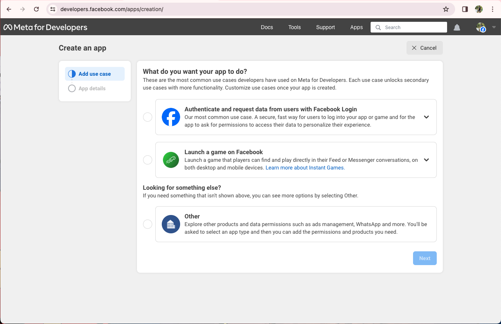
- Then right afterwards fill-in your app information.

Getting your Facebook Client ID and Facebook Secret 

- Go to App Settings and Choose Basic
- 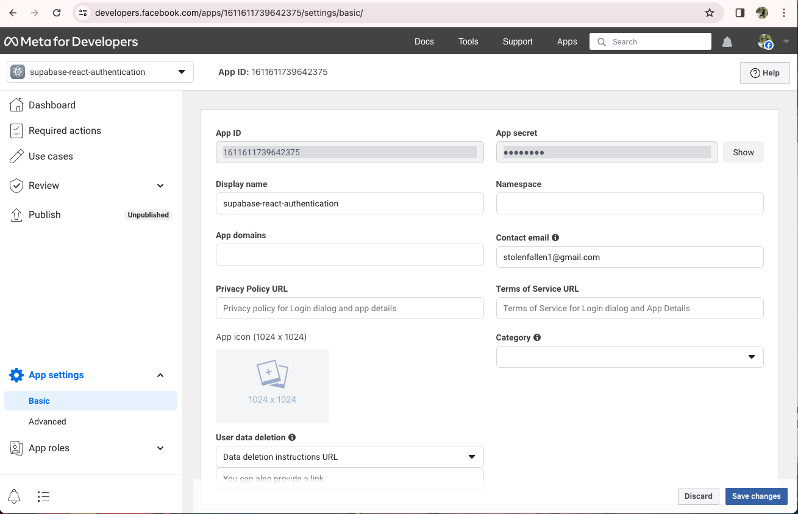
- App ID is your Facebook Client ID and App secret is your Facebook Secret

Adding Facebook Client ID and Facebook Secret to your supabase project.

- Go back to your supabase dashboard, navigate in the authentication secion and go to providers then select Facebook
- 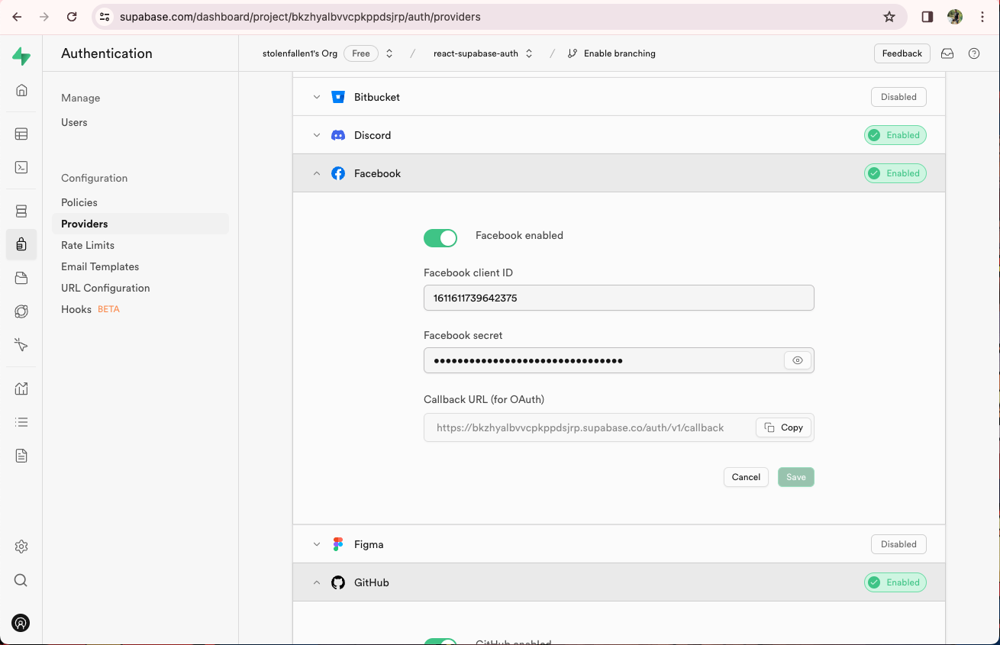
- Paste the Client ID and Secret from facebook
- While at it please do copy the callback URL and save it somewhere ( notes ) cause we will be using that repeatedly

Further Configuration to your Facebook app

- Go back to your facebook / meta for developer apps dashboard and in the left sidebar click use cases
- Then click the button customize
- First make sure in the permissions section that email and public_profile are set to testing.
- 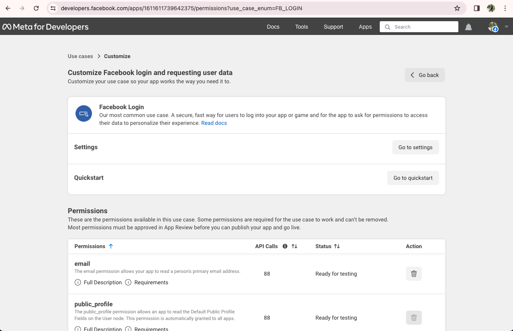
- Next, click on Go to settings
- Find the text field Valid OAuth Redirect URIs and paste the callback URL we saved from supabase earlier.
- 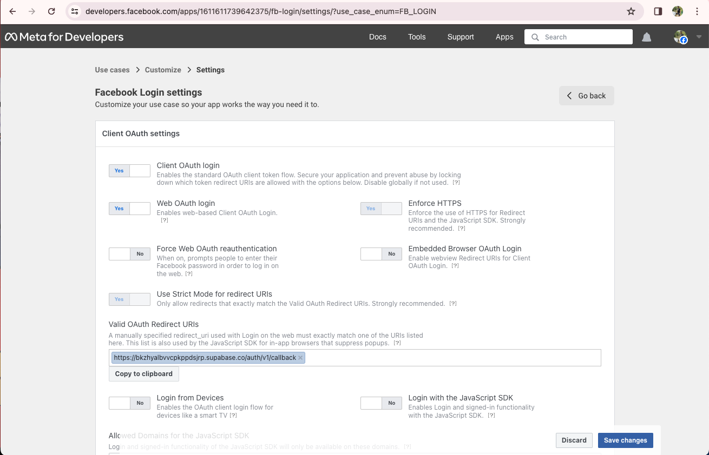
- Hit Save
- That's it and give it a whirl 


If you find it hard to follow the documentation please read here: The official documentation from supabase [https://supabase.com/docs/guides/auth/social-login/auth-facebook] 

### GitHub Configuration 

Setting up GitHub logins for your Application consists of 2 parts: 

- Create and configure a GitHub OAuth App
- Add your GitHub keys to your Supabase project ( Client ID and Client Keys )

Access your github account

- Go to [https://github.com/]
- Then Sign in

Create a GitHub OAuth app

- Click on your profile photo at the top right
- Navigate in the setting in should be located in the bottom of the menu 
- In the left sidebar, Click the Developer Settings it should be located near the bottom 
- And you should be redirected to this page 
- 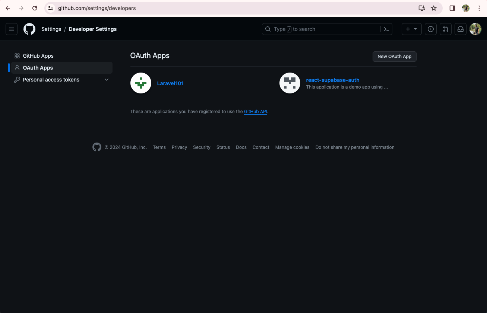

Register a new OAuth application on GitHub

- Click Register a new application. If you've created an app before, click New OAuth App
- In Application name, type the name of your app
- In Homepage URL, type the full URL to your app's website ( Example: localhost:5173 )
- In the Authorization callback URL, enter the callback URL of your supabase app ( the one we used on facebook before )
- The save changes.

Copy your new OAuth credentials from GitHub

- Copy and save your Client ID
- Click and Generate a new client secret, then copy and save
- 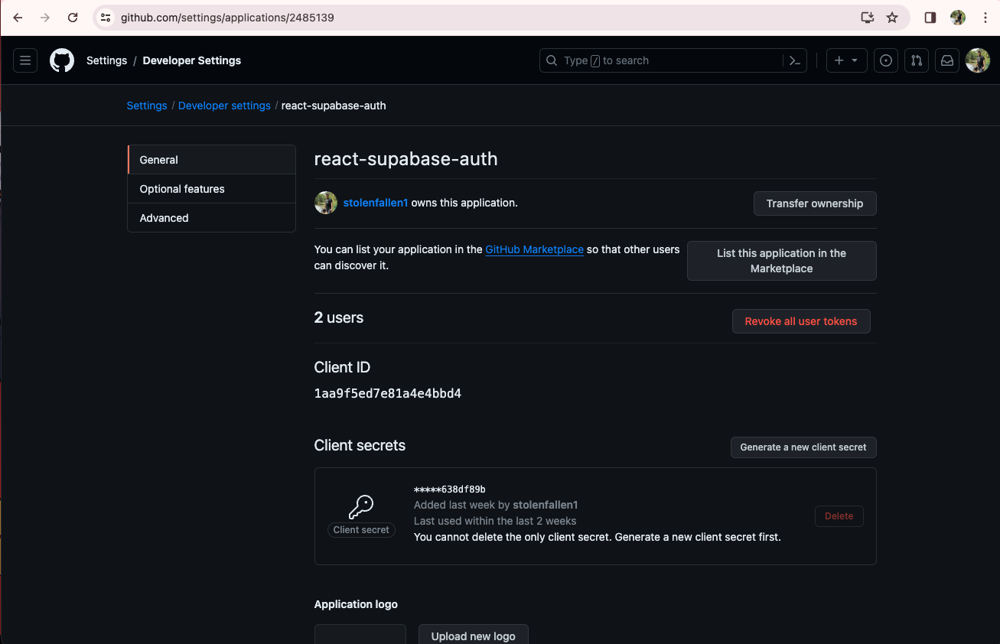

Enter your GitHub credentials into your supabase project

- Go to your supabase project dashboard [https://supabase.com/dashboard/projects]
- In the left sidebar, click the Authentication icon ( near the top )
- Click on Providers
- Find GitHub
- Then enter the credentials saved / copied ( Client ID and Client Secret )
- 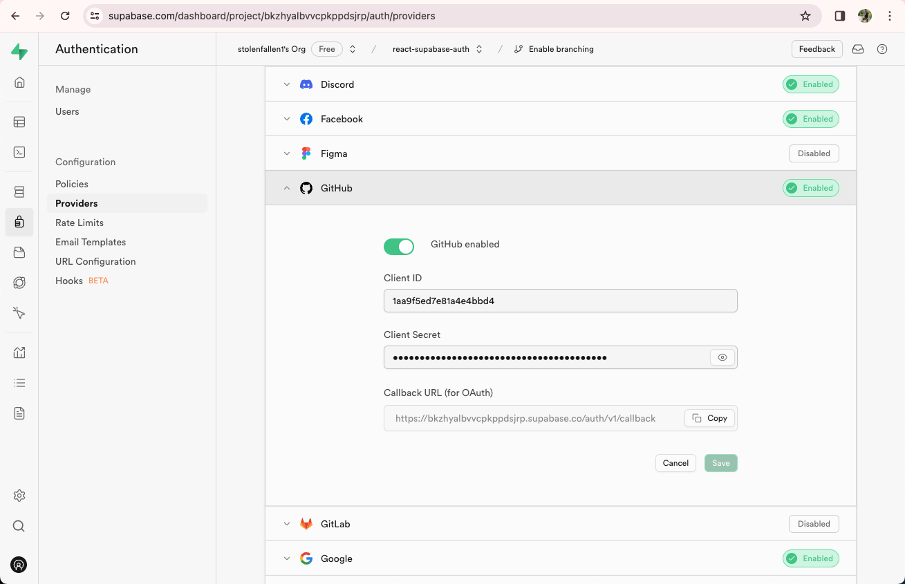
- Hit Save
- That's it and give it a whirl 

If you find it hard to follow the documentation please read here: The official documentation from supabase [https://supabase.com/docs/guides/auth/social-login/auth-github]

### Google Configuration 

Setting up Google logins for your Application consists of 3 parts: 

- Create and configure a Google Cloud Project
- Add your Google App's Client ID and Client Secret
- Configuring the OAuth Consent Screen Settings of your Google Cloud Project

Access your Google Cloud Account 

- Go to [https://cloud.google.com/]
- Sign In and look for "Console"

Creating a Google Cloud Project

- After Getting redirect to the console dashboard, Create a new project by clicking on the Select a Project -> New Project 
- Input all the necessary credentials google ask for.

Obtaining OAuth Credentials for your Google Cloud Project

- Navigate in the Credentials page of the console [https://console.cloud.google.com/apis/credentials]
- 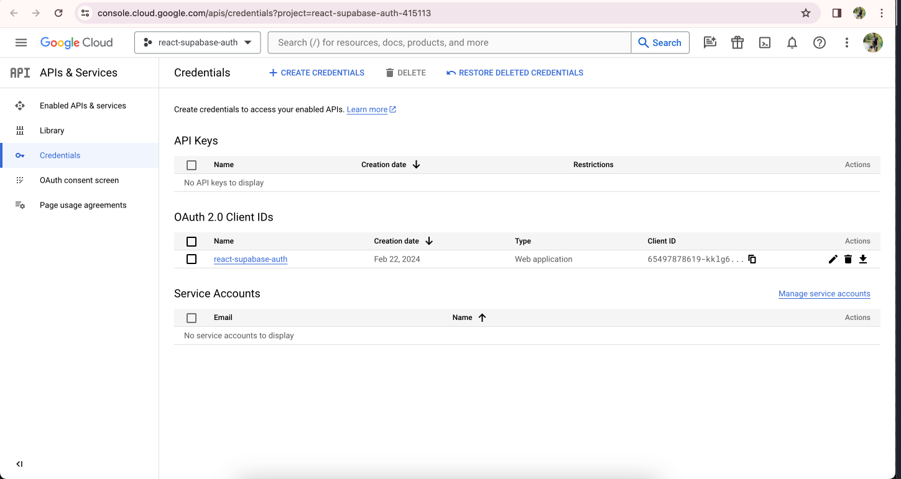
- Click on Create Credentials and Choose OAuth Client ID 
- Choose Web Application for the Application Type
- In Authorized redirect URIs Copy the URL Callback from supabase that we have been using previously.
- Also add your localhost URL to the Authorized Javascript origins ( during development )
- After that located on the right half of the screen is where your Client ID and Client Secret is located.
- 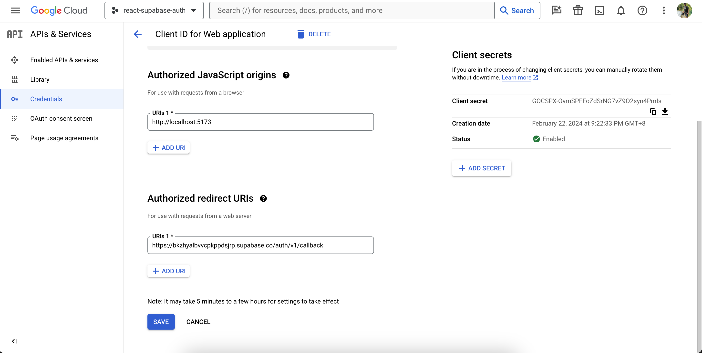
- Copy and Hit Save Changes

Configure the OAuth consent screen settings

- You can navigate to the OAuth consent screen in the left sidebar of the dashboard or just use this link [https://console.cloud.google.com/apis/credentials/consent]
- 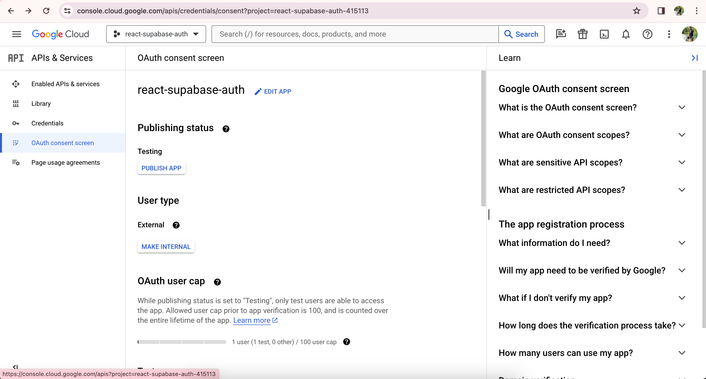
- Click on Edit App and Add your Supabase Project URL to the Authorized domain 1 ( Supabase URL is the one you are using in your .env.local )
- Click Save and Continue
- In the Scopes section make sure to Configure the non-sensitive scopes by making sure the following ones are select 
```.../auth/userinfo.email```
```.../auth/userinfo.profile```
```openid```

Add your Google credentials into your Supabase Project

- Go to your supabase project dashboard
- In the left sidebar, click the Authentication 
- Click on Providers 
- Look for Google from the accordion / expansion panel lists and turn on Enable Google
- Enter your Google Client ID and Google Client Secret saved in the previous step
- 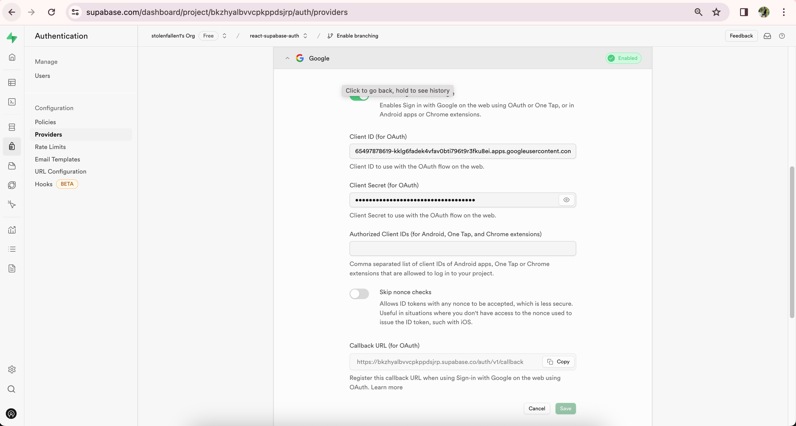
- Click Save!
- That's it and give it a whirl

If you find it hard to follow the documentation please read here: The official documentation from supabase  [https://supabase.com/docs/guides/auth/social-login/auth-google]

### Discord Configuration

Setting up Discord logins for your Application consists of 2 parts: 

- Create and configure a Discord Application
- Add your Discord OAuth Consumer keys to your Supabase Project

Access your Discord Developer Account

- Go to [https://discord.com]
- Create a discord account if don't have one, once logged in go to [https://discord.com/developers/applications]
- You should be able to see this screen 
- 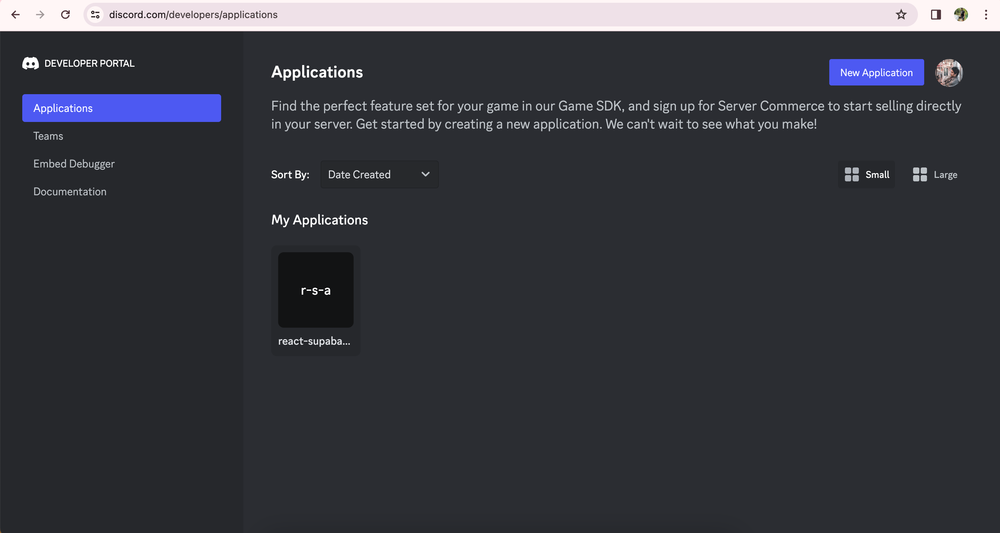

Creating a discord application

- Click on New Application at the top right
- Enter the name of your application and click Create
- Click on the OAuth under settings extension panel in the left sidebar
- Click Add Redirect under Redirects
- Paste your callback URL from supabase
- Click Save Changes 
- Copy your Client ID and Client Secret under Client Information. 
- 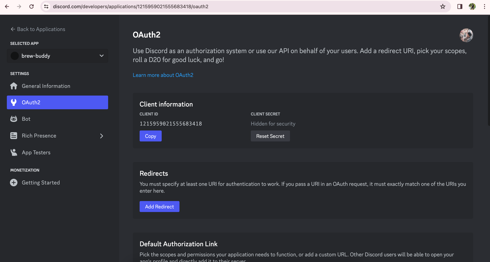

Add your Discord credentials into your Supabase project

- Go to your supabase project dashboard
- In the left sidebar, click the Authentication 
- Click on Providers 
- Look for Discord from the accordion / expansion panel lists and turn on Enable Discord
- Enter your Discord Client ID and Discord Client Secret saved in the previous step
- Click Save!
- That's it and give it a whirl

If you find it hard to follow the documentation please read here: The official documentation from supabase [https://supabase.com/docs/guides/auth/social-login/auth-discord]


